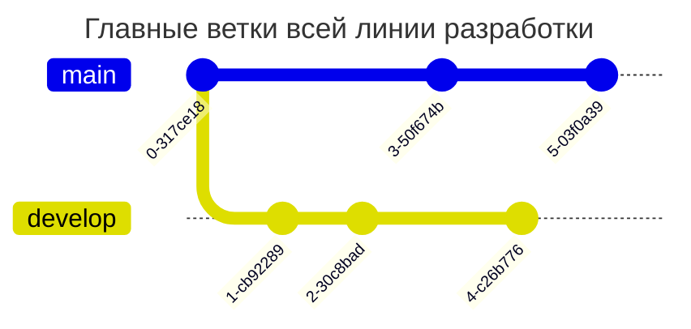
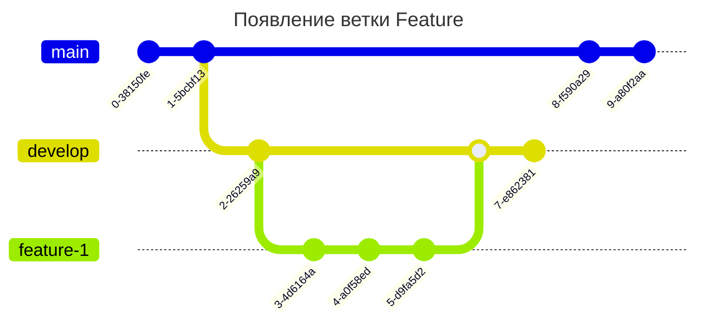
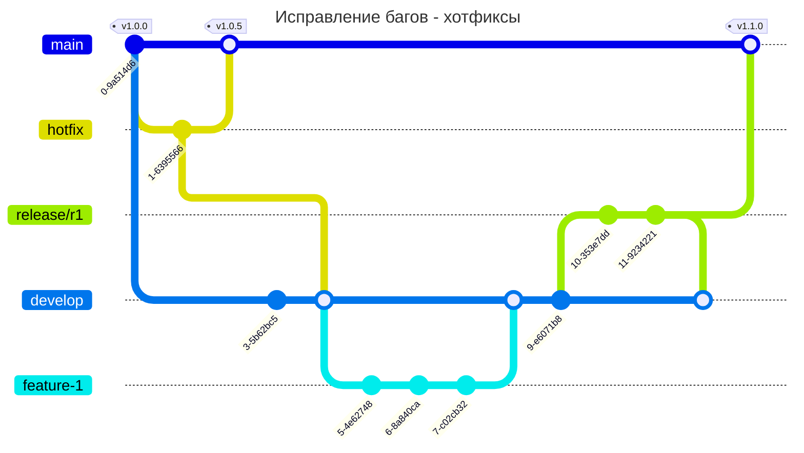

# Методологии разработки

## Intro
До появления систем контроля версий, таких как **Git**, **Svn**, **Mercurial**, etc. разработка велась совсем по другому: команды были маленькие, разработчики использовали **PUTTY** и **FTP** для обмена кодом, а hotfix выкатывали сразу на prod-машинах используя **VIM**.

**Git** стал самой популярной из систем контроля версий, но вместе с тем имел важный недостаток: наряду с поставляемым инструментом не прикладывался документ (стандарт) о том как лучше вести проекты, используя этот самый инструмент.

Поэтому и стали появляться самые различные методики, одна из наиболее популярной - **GitFlow**. Она настолько широкоизвестна, что есть даже специальные расширения возможностей обычного **Git** под **GitFlow**.

## GitFlow
> **GitFlow** - методика работы с **Git**, в которой используются функциональные ветки и несколько основных.

**GitFlow** хорошо подходит, если в вашей команде релизный цикл составляет 1-2 недели (классно сочетается со спринтами в Agile scrum).

Функциональные ветки используются для внедрения фичей, основные ветки используются для создания релизов или отслеживания нашего прогресса.

### Ветки Main и Develop.
**Main** - мастер/основная ветка, которая выкладывается на **prod**. Обычно на вершинах этой ветки располагаются теги, по которым делаются сборки **CI/CD**.

**Develop** - рабочая ветка, куда попадают все принятые изменения. Фактически тут лежит код после ревью, который когда-то попадет в **Main**.

> [!CAUTION]
> Нельзя делать commit в **Main** и **Develop** напрямую.

**GitHub** позволяет, настроить политики, чтобы запрещать пушить в определенные ветки.

### Ветка Feature/Bug.
**Feature/Bug** ветка создается для реализации задачи. Часто можно встретить название этой ветки, построенное по следующему принципу:
    
    feature-<номер_задачи_в_багтрекере>

Когда разработчик приходит и хочет внедрить какую-то фичу, он берет **Develop**-ветку и делает от нее брэнч. Далее он дает ей название (например как имя фичи) и в ней работает. Там он может спамить сколько угодно коммитов, терзать ветку как угодно, но наконец получить работающую фичу (или исправленный баг, если речь идет о багах).

Затем ему нужно будет поставить **pull request**. И уже далее, из **Feature**-ветки, попасть в **Develop** он сможет только после **code-review**. И это одна из особенностей **GitFlow**, потому как тут мы фокусируемся на **code-review**, чтобы доставлять качественный код в продакшен.

### Ветка Release.
**Release** - ветка для подготовки релиза.

Как только в **Develop** оказалось достаточно фичей для релиза, мы начинаем создавать ветку **Release**. 

Многие считают эту ветку дополнительной, но на самом деле это не так. 

**Зачем она нужна?**

Как только мы отбранчевались от **Develop**, мы сказали "стоп", другими словами, зафиксировали набор функционала, который в результате пойдет в релиз.

Эта же ветка обычно **тестируется ручными тестировщиками** (если они есть) и прогоняется **авто-тестами**.

На самом деле в **Release** можно что-то закоммитить, но это должны быть только фиксы. Например, тестировщик нашел неисправность, значит исправляем это и делаем коммит. Поэтому **Release** может в этом смысле немного отойти от **Develop** вперед.

Еще нужно не забыть влить релиз не только в мастер-ветку (чтобы выложить сам релиз), но и в девелоп, что забрать фиксы туда.

Когда релиз заливается в мастер, на мастер желательно ставить **тэг** - версия приложения. На него как раз и будет триггериться **CI/CD**.

### Нашелся баг, что делать? Ветка Hotfix.
Исправлять багу, проходясь по всему флоу заново очень долго. Пользователи будут недовольны, поэтому, для этих целей создается отдельная ветка **Hotfix**, которая бранчуется только от мастер-ветки (у нас это **Main**).

С точки зрения **CI-процессов** важно:
* прогонять все тесты на **Release**, включая ручное тестирование
* прогонять авто-тесты в **Feature** ветках во время **pull requests**
* на **Develop** и так есть тесты
* на хотфиксах авто-тесты
* при вливании в **Main** иметь какое-нибудь end-to-end (E2E) тестирование, покрывающее весь функционал приложения

### Плюсы и минусы
#### Плюсы
* Удобный процесс для код ревью
* Подходит для релизов 1 раз в 1-2 недели
* Хорошо подходит для работы с несколькими релизами и командами

#### Минусы
* Сложно делать много частых релизов
* Будет больше мердж конфликтов
* Много мердж-коммит истории

#### Сценарии использования GitFlow в реальных проектах
Этот метод ведения разработки хорошо подходит для распределенных команд.

Например, для **open-source** проекта, у которого есть мэйнтейнеры, которые пускают какие-то фичи, **pull request'ы** в **Develop** просто необходимы.

Или же представим, что имеется большая распределенная команда, одной из целью которой является, чтобы каждый из участников обязательно проходил **code-review**, тогда этот подход тоже годится.

> Рекомендовано для команд, работающих по Scrum. Еще вместо отдельных релизных веток под каждый из релизов можно сделать релизную ветку для каждой команды.

